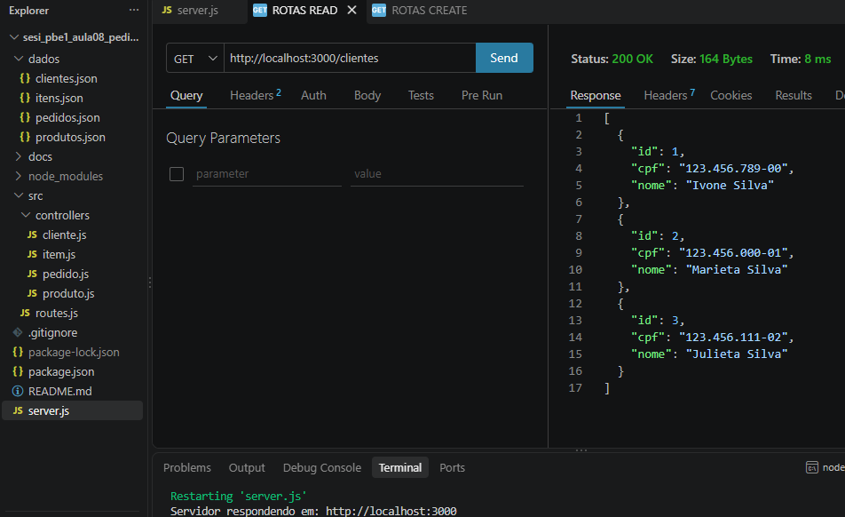
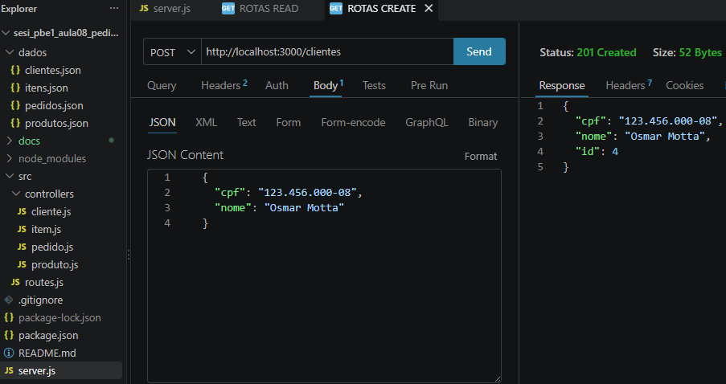
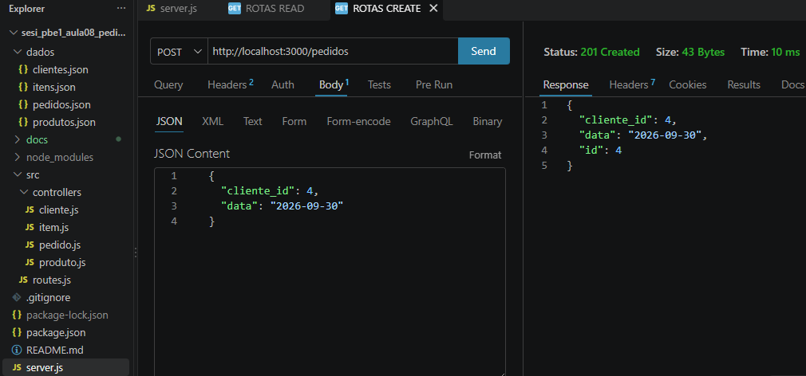
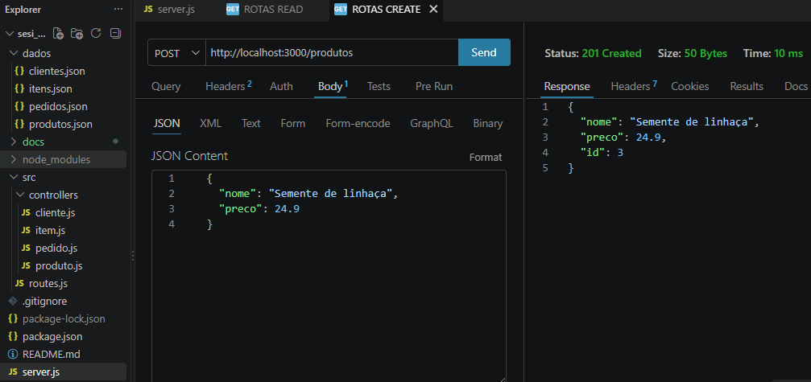
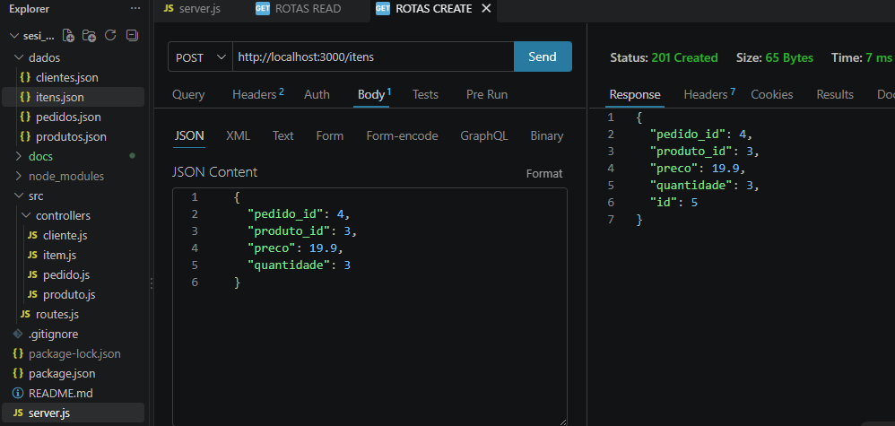
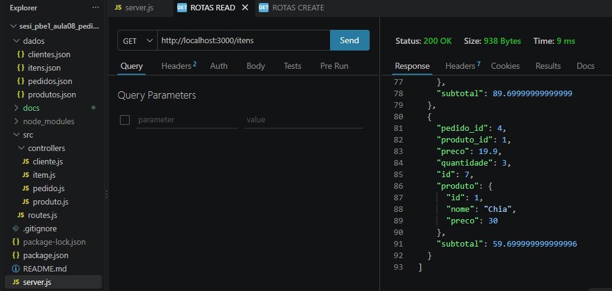
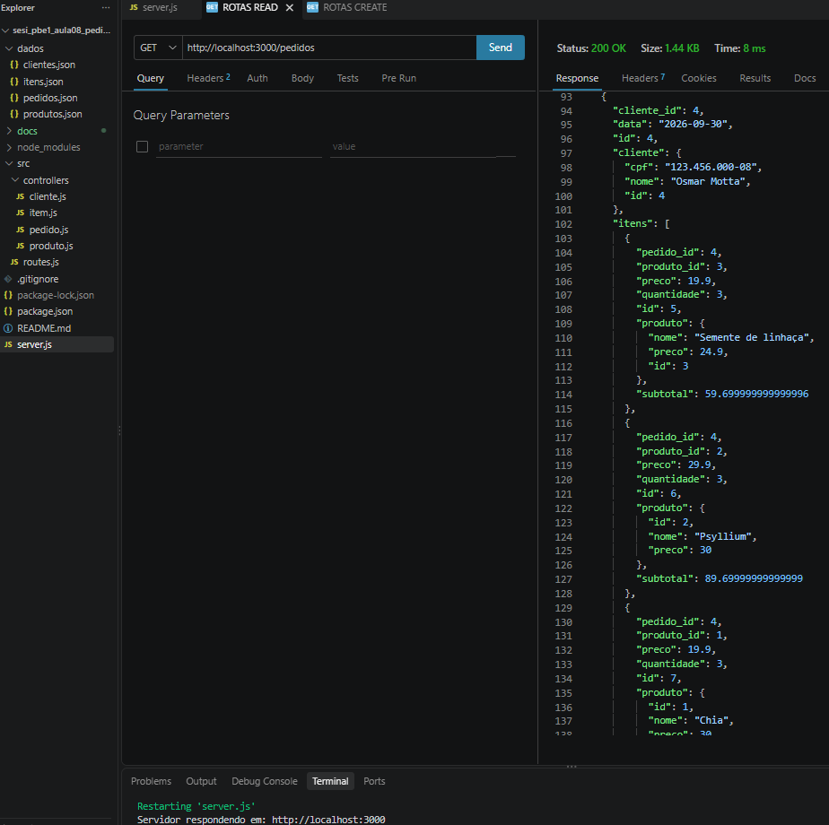
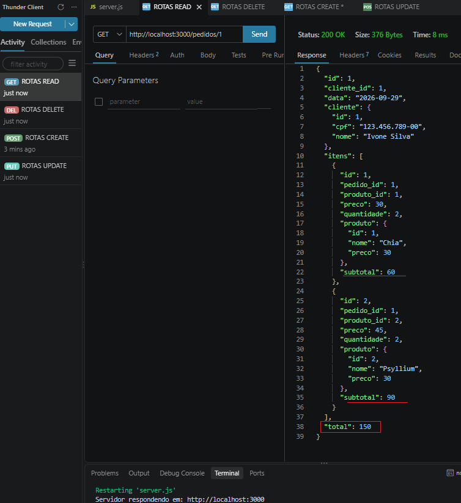

# Pedidos Backend MVC DC
Back-end com duas coleções mockup JSON clientes e pedidos, CRUD, para aprender, MVC e UML diagrama de classes
## Diagrama

## Tecnologias
- Node.js
- VsCode (Thunder Client)
- JavaScript
- MVC

## Passos para testar
- Clone esta repositório e abra com VsCode
- Instale as depenências e execute com os seguintes comandos no terminal:
```bash
npm install
npm run dev
```
- Resultado no terminal:
```bash
Servidor respondendo em: http://localhost:3000
```

## Relatório de testes

<details>
<summary>Testes com extensão <b>Thunder Client</b></summary>

- 1 Listando todos os **Clientes**
<br>
- 2 Cadastrando um novo **Cliente**, retornou **201 criado** e o id automaticamente incrementado.
<br>
- 3 Cadastrando um novo **Pedido**, retornou **201 criado** e o id automaticamente incrementado.
<br>
- 4 Cadastrando um novo **Produto**, retornou **201 criado** e o id automaticamente incrementado.
<br>
- 5 Cadastrando um novo **Item** no pedido, retornou **201 criado** e o id automaticamente incrementado.
<br>
- 6 Listando todos os **Itens** cadastrados, retornou a **composição do produto** e calculou o **subtotal**.
<br>
- 7 Listando todos os **Pedidos** cadastrados:
    - Retornou a **composição do cliete**,
    - **Agregou** os **ítens**
    - Calculou os **subtotais**
    - Calculou o **total**
<br>
- 8 Buscando por um **Pedido por id**:
    - Retornou a **composição do cliete**,
    - **Agregou** os **ítens**
    - Calculou os **subtotais**
    - Calculou o **total**
<br>

</details>