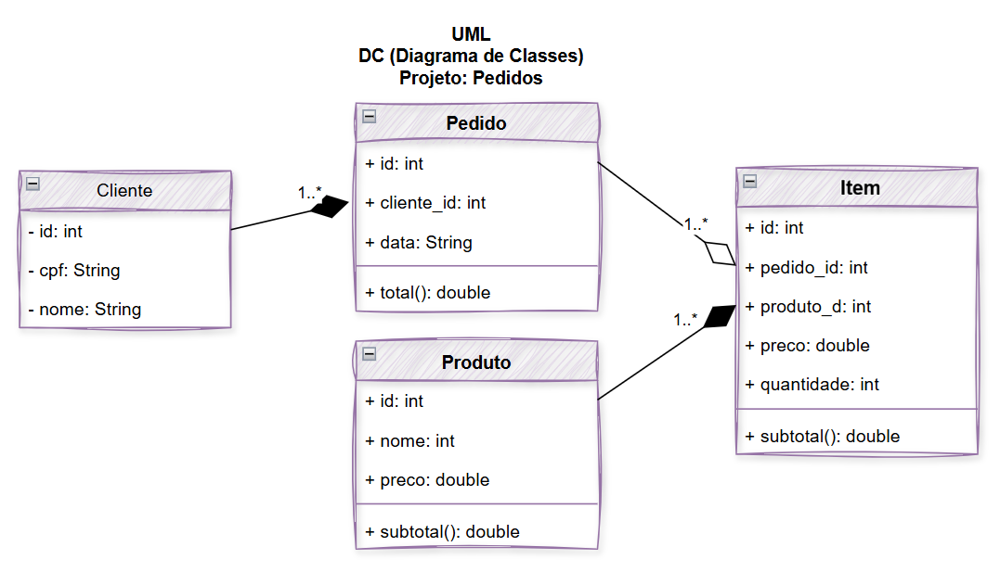

# Pedidos Backend MVC DC
Back-end com duas coleções mockup JSON clientes e pedidos, CRUD, para aprender, MVC e UML diagrama de classes
## Diagrama

## Tecnologias
- Node.js
- VsCode (Thunder Client)
- JavaScript
- MVC

## Passos para testar
- Clone esta repositório e abra com VsCode
- Instale as depenências e execute com os seguintes comandos no terminal:
```bash
npm install
npm run dev
```
"# sesi_pbe1_aula08_pedidos_mvc_uml_dc_cruds_2026" 
